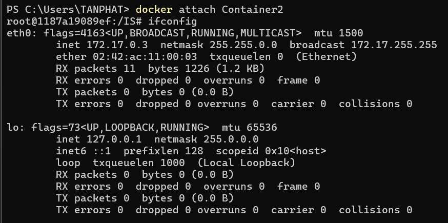

# Task 1: Transfer files between computers  
**Question 1**: 
Implement public-key based authentication step-by-step with openssl according the following scheme.

**Answer 1**:

Create 2 container(Container1 and Container2)


Container1 (Server): IP addr: 172.17.0.2


Container2 (Client): IP addr: 172.17.0.3


Check openssl 
root@95dac32b364c:/IS# openssl version
OpenSSL 3.0.13 30 Jan 2024 (Library: OpenSSL 3.0.13 30 Jan 2024)

Create directory client server


Generate a Public-Private Key Pair in Container2 (Client): 


Create challenge.txt
```sh
root@95dac32b364c:/IS/authentication_lab# cd server
root@95dac32b364c:/IS/authentication_lab/server# echo "ChallengeMessage" > c
hallenge.txt
```

Encrypt the Challenge Message


# Task 2: Encrypting large message 
**Question 1**:
Encrypt the file with aes-256 cipher in CFB and OFB modes. How do you evaluate both cipher as far as error propagation and adjacent plaintext blocks are concerned. 

**Answer 1**:
In Container1 create file plaintext.txt (70 bytes)


Encrypt with CFB Mode (ciphertext_cfb.bin), decrypt with CFB Mode (decrypted_cfb.txt) and there's no difference(diff and sha256sum)


Encrypt with OFB Mode (ciphertext_ofb.bin), decrypt with OFB Mode (decrypted_ofb.txt) and there's no difference(diff and sha256sum)


Evaluate Both Cipher Modes
***Error Propagation***
- CFB Mode:
If an error occurs in one ciphertext block, it affects the corresponding plaintext block and the next one.
This happens because each ciphertext block is used to compute the next block's encryption.

- OFB Mode:
Errors in one ciphertext block affect only the corresponding plaintext block.
The independent keystream generation ensures that errors do not propagate beyond the affected block.

***Adjacent Plaintext Blocks***
- CFB Mode:
Adjacent plaintext blocks are interdependent due to feedback from ciphertext blocks during encryption.
This makes CFB mode more secure in some scenarios but less resilient to errors.

- OFB Mode:
Adjacent plaintext blocks are independent because encryption is based on a separately generated keystream.
This makes OFB mode resilient to block-level errors and ensures faster recovery from corrupted ciphertext.

**Question 2**:
Modify the 8th byte of encrypted file in both modes (this emulates corrupted ciphertext).
Decrypt corrupted file, watch the result and give your comment on Chaining dependencies and Error propagation criteria.

**Answer 2**:
Convert the binary file(ciphertext_cfb.bin) into a hexadecimal representation and use nano to change the file


In nano

The 8th byte is 5f and we will change it to ff and save (ctrl+o)


Convert hex back into binary
```sh
xxd -p -r ciphertext_cfb.hex > ciphertext_cfb_corrupted.bin
```

Decrypt corrupted due to changes in file


- Do similarly with OFB mode

nano of ciphertext_ofb.bin


the 8th byte is 5f and we change it to ff


Convert back in to binary and decrypt


***Chaining Dependencies***
- CFB Mode:
Chaining Dependency in CFB: In CFB, each ciphertext block is chained with the previous ciphertext block. This means that modifying one byte of ciphertext will not ONLY affect the corresponding plaintext byte during decryption but can also affect SUBSEQUENT bytes because the decryption process of the current block relies on the previous ciphertext block.
If you modify the 8th byte in the ciphertext, the 8th byte of plaintext will be corrupted, and this error will propagate to the 9th byte of plaintext (next block) due to the chaining dependency.

- OFB (Output Feedback) Mode:
Chaining Dependency in OFB: In OFB, the encryption of each byte is independent of the previous plaintext block, but the keystream is chained from ONE BLOCK TO THE NEXT. 
Modifying the 8th byte of ciphertext in OFB mode would only affect the corresponding byte in the decrypted plaintext. There is no chaining of errors to subsequent plaintext blocks, meaning the NEXT BYTE of plaintext remain UNAFFECTED by the corrupted ciphertext byte.

***Error Propagation Criteria***
- CFB has more error propagation and chaining dependencies, making it more vulnerable to errors.
- OFB has minimal error propagation and no chaining dependency, making it more resilient to corruption, though it still affects the specific byte that is modified in the ciphertext.